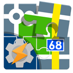

# Locus Map Tasker Plugin

This is a [Tasker](https://tasker.joaoapps.com/) plugin for [Locus Map](http://www.locusmap.eu) application.

It was created to solve very special customization needs which could not get into Locus Map.

# Installation

The project setup was made with Android Studio and run's best there.
But you could just get the App ready to use from
[Google Play](https://play.google.com/store/apps/details?id=falcosc.locus.addon.tasker&utm_source=GitHub)

# Usage

After installation you will find this App at Tasker in the plugin section.

## Example configuration

I did create some Tasker example profiles and screen for common use-cases:

- [Remaining elevation to target](https://github.com/Falcosc/locus-addon-tasker/wiki/Examples#remaining-elevation-to-target-as-dashboard-overlay) - as dashboard overlay
- [Center Map to GPS on move](https://github.com/Falcosc/locus-addon-tasker/wiki/Examples#center-map-to-gps-on-move)
- [Locus Software display lock as replacement for android display lock](https://github.com/Falcosc/locus-addon-tasker/wiki/Examples#locus-software-display-lock-as-replacement-for-android-display-lock)
- [Open Navigation in Google Maps](https://github.com/Falcosc/locus-addon-tasker/wiki/Examples#open-navigation-in-google-maps)
- [Start Navigation or Guiding in Locus Map](https://github.com/Falcosc/locus-addon-tasker/wiki/Examples#start-navigation-or-guiding-in-locus-map)

# License

This project is licensed under the GNU GPL License - see the [LICENSE](LICENSE) file for details.