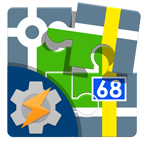

# Locus Map Tasker Plugin

This is a [Tasker](https://tasker.joaoapps.com/) plugin for [Locus Map](http://www.locusmap.eu) application.

It was created to solve very special customization needs which could not get into Locus Map.

# Installation

The project setup was made with Android Studio and run's best there.
But you could just get the App ready to use from
[Google Play](https://play.google.com/store/apps/details?id=falcosc.locus.addon.tasker&utm_source=GitHub)

# Usage

After installation you will find this App at Tasker in the plugin section.

## Example configuration

I did create some Tasker example profiles and screen for common use-cases:

- [Remaining elevation to target](https://github.com/Falcosc/locus-addon-tasker/wiki/Examples#remaining-elevation-to-target-as-dashboard-overlay) - as dashboard overlay
- [Center Map to GPS on move](https://github.com/Falcosc/locus-addon-tasker/wiki/Examples#center-map-to-gps-on-move)
- [Locus Software display lock as replacement for android display lock](https://github.com/Falcosc/locus-addon-tasker/wiki/Examples#locus-software-display-lock-as-replacement-for-android-display-lock)
- [Open Navigation in Google Maps](https://github.com/Falcosc/locus-addon-tasker/wiki/Examples#open-navigation-in-google-maps)
- [Start Navigation or Guiding in Locus Map](https://github.com/Falcosc/locus-addon-tasker/wiki/Examples#start-navigation-or-guiding-in-locus-map)
- [Geotagging](https://github.com/Falcosc/locus-addon-tasker/wiki/Examples#Geotagging)

## Implemented Functions

### Run Tasker Tasks from anywhere
- run task from get location
- run task from point
- run task from main functions
- run task from search menu
- run task from point screen
- up to 2 buttons per action
- one or many tasks per button filtered by regex

### Locus Action
over 20 tasks with over 50 parameters
- dashboard
- function
- guide_to
- gps_on_off
- live_tracking_asamm
- live_tracking_custom
- map_center
- map_layer_base
- map_move_x
- map_move_y
- map_move_zoom
- map_overlay
- map_reload_theme
- map_rotate
- map_zoom
- navigate_to
- navigation
- open
- poi_alert
- preset
- quick_bookmark
- screen_lock
- screen_on_off
- track_record
- weather

### Support of Multiple Locus Maps Versions
If you have multiple versions running on the same device, you can select from which version you want to collect the data

## Data Access
- over 20 fields for Locus App Details
- over 50 fields for Location and Sensors
- over 20 fields for Track Recording
- over 20 fields for Guidance
- custom fields like remaining elevation

### Locus App Details
- dir_backup
- dir_root
- dir_export
- dir_geocaching
- dir_mapitems
- dir_maps
- dir_mapsvector
- dir_mapsonline
- dir_srtm
- locus_package
- locus_isrunning
- last_active
- unit_weight
- unit_altitude
- unit_temperature
- unit_angle
- unit_speed
- unit_length
- unit_area
- unit_energy
- unit_slope
- gc_owner_name

### Request Monitoring
- select_version_req_durations
- locus_info_req_durations
- action_task_req_durations
- track_points_req_durations
- update_container_req_durations

### Status Fields
- my_latitude
- my_longitude
- my_altitude
- my_latitude_original
- my_longitude_original
- my_altitude_original
- my_accuracy_hor
- my_accuracy_ver
- my_gps_fix
- my_speed
- my_bearing
- my_loc_provider
- sensor_hrm
- sensor_cadence
- sensor_power
- sensor_speed
- sensor_strides
- sensor_temperature
- sensor_battery_temperature
- pace
- speed_vertical
- slope
- is_gps_valid
- gps_sat_used
- gps_sat_all
- declination
- heading
- gps_angle
- course
- roll
- pitch
- is_user_touching
- is_guide_enabled
- is_track_rec_recording
- is_track_rec_paused
- track_rec_profile
- is_enabled_my_location
- is_map_visible
- active_live_track_id
- active_dashboard_id
- gnss_hdop
- gnss_pdop
- gnss_vdop
- gnss_quality
- gnss_sats_used
- gnss_sats_visible
- gnss_diff_msg_age
- gnss_ntrip_mount_point
- gnss_observ_time_start
- gnss_observ_time_end
- extra_gssn_signal_strength
- extra_ant_phase_center_offset
- extra_pole_height
- simulate_error_hidden
- simulate_error_visible

### Map Fields
- map_zoom_level
- map_distance_to_gps
- map_rotate_angle
- map_bottom_right_lon
- map_bottom_right_lat
- map_top_left_lon
- map_top_left_lat
- map_center_lon
- map_center_lat
- map_center_altitude

### Track Recording Fields
- rec_total_length
- rec_total_length_move
- rec_eleva_neg_length
- rec_eleva_pos_length
- rec_eleva_neutral_length
- rec_eleva_neutral_height
- rec_eleva_downhill
- rec_eleva_uphill
- rec_altitude_min
- rec_altitude_max
- rec_start_time
- rec_stop_time
- rec_time
- rec_time_move
- rec_speed_max
- rec_average_speed_total
- rec_average_speed_move
- rec_point_count
- rec_cadence_avg
- rec_cadence_max
- rec_energy_burned
- rec_hrm_avg
- rec_hrm_max
- rec_strides_count
- rec_power_avg
- rec_power_max
- rec_temp_min
- rec_temp_max
- rec_has_temp

### Guidance Fields
- guide_target_lon
- guide_target_lat
- guide_target_angle
- guide_target_azimuth
- guide_target_dist
- guide_target_name
- guide_target_time
- guide_dist_from_start
- guide_dist_to_finish
- guide_target_id
- guide_time_to_finish
- guide_type
- guide_valid
- guide_navpoint1_action
- guide_navpoint1_dist
- guide_navpoint1_extra
- guide_navpoint1_lon
- guide_navpoint1_lat
- guide_navpoint1_name
- guide_navpoint1_time
- guide_navpoint2_action
- guide_navpoint2_dist
- guide_navpoint2_extra
- guide_navpoint2_lon
- guide_navpoint2_lat
- guide_navpoint2_name
- guide_navpoint2_time
- guide_nextvia_dist
- guide_nextvia_name
- guide_nextvia_time

### Custom Fields
- calc_remain_uphill_elevation
- calc_remain_downhill_elevation
- navigation_point_index
- navigation_track_name

# License

This project is licensed under the GNU GPL License - see the [LICENSE](LICENSE) file for details.